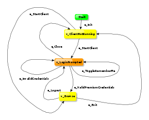

## Overview 

GraphWalker is a [Model-Based testing](https://en.wikipedia.org/wiki/Model-based_testing) tool. It reads models in the shape of [directed graphs](https://en.wikipedia.org/wiki/Directed_graph), and generate [test] paths from these graphs.



A model can look like the one to the right. The model is collection of arrows and nodes and together they create a graph.

* An arrow represents an action.
* A node represents a verification.

## What it does

Given the graph, GraphWalker generates a path from the graph. This path is then feed to the tool of your choice to execute the test.

## How to get it

Either download the standalone jar file, or include it directly in your java project. The latest release version is 3.4.0. In your maven project, add this to your pom.xml file:

```xml
<dependency>
   <groupId>org.graphwalker</groupId>
   <artifactId>graphwalker-core</artifactId>
   <version>3.4.0</version>
</dependency>
```

